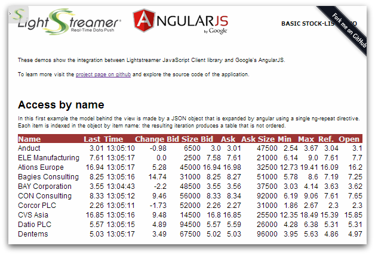

# Lightstreamer - Basic Stock-List Demo - HTML (AngularJS, ng-grid) Client

<!-- START DESCRIPTION lightstreamer-example-stocklist-client-angular -->

A simple stocklist demo application showing integration between [AngularJS](http://angularjs.org/) and the <b>Lightstreamer JavaScript Client library</b>.

## Live Demo

[](http://demos.lightstreamer.com/AngularJSDemo)<br>
### [ View live demo](http://demos.lightstreamer.com/AngularJSDemo)<br>

## Details

This demo displays real-time market data for ten stocks, generated by a feed simulator in a similar way to the [Lightstreamer - Basic Stock-List Demo - HTML Client](https://github.com/Lightstreamer/Lightstreamer-example-StockList-client-javascript#basic-stock-list-demo---html-client).<br>

This page uses the <b>JavaScript Client API for Lightstreamer</b> to handle the communications with Lightstreamer Server and uses <b>AngularJS</b> to display the real-time data pushed by Lightstreamer Server.

A Lightstreamer Subscription is used for subscribing to the data. The onItemUpdate callback implementation fills an object that is used by AngularJS to populate the HTML.
Three different approaches to the data display are shown; the first two use "vanilla" AngularJS whereas the third one is based on [ng-grid](http://angular-ui.github.io/ui-grid/)

The demo includes the following client-side functionalities:
* A [Subscription](http://www.lightstreamer.com/docs/client_javascript_uni_api/Subscription.html) containing 10 items, subscribed to in **MERGE** mode.

Further details about integration between AngularJS and Lightstreamer are discussed in this blog post: "[Yet Another Integration: AngularJS](http://blog.lightstreamer.com/2013/11/yet-another-integration-angularjs.html)".

<!-- END DESCRIPTION lightstreamer-example-stocklist-client-angular -->

## Install

If you want to install a version of this demo pointing to your local Lightstreamer Server, follow these steps:

* Note that, as prerequisite, the [Lightstreamer - Stock- List Demo - Java Adapter](https://github.com/Lightstreamer/Lightstreamer-example-Stocklist-adapter-java) has to be deployed on your local Lightstreamer Server instance. Please check out that project and follow the installation instructions provided with it.
* Launch Lightstreamer Server.
* Get the `lightstreamer.js` file from the [latest Lightstreamer distribution](http://www.lightstreamer.com/download) and put it in the `src/js` folder of the demo. Alternatively, you can build a `lightstreamer.js` file from the [online generator](http://www.lightstreamer.com/docs/client_javascript_tools/generator.html).
In that case, be sure to include the LightstreamerClient, Subscription, ConnectionSharing, and StatusWidget modules and to use the "Use AMD" version.
* Get the `require.js` file form [requirejs.org](http://requirejs.org/docs/download.html) and put it in the `src/js` folder of the demo.
* AngularJS is currently hot-linked in the html page: you may want to replace it with a local version and/or to upgrade its version.

The above setup will make the first two tables work. To also start the ng-grid version run:

* jQuery is currently hot-linked in the html page: you may want to replace it with a local version and/or to upgrade its version.
* Also ng-grid is currently hot-linked in the html page: again, you may want to replace it with a local version and/or to upgrade its version.

You can deploy this demo inside Lightstreamer internal web server or in any other web server.
If you choose the former, please create the folders `/pages/demos/[demo_name]` into your Lightstreamer server installation then copy the contents of the src folder of this project there.

The client demos configuration assumes that Lightstreamer Server, Lightstreamer Adapters, and this client are launched on the same machine. If you need to target a different Lightstreamer server, please search for this line:
```js
var lsClient = new LightstreamerClient(protocolToUse+"//localhost:"+portToUse,"DEMO");
```
in `lsClient.js` and change it accordingly.

The demo is now ready to be launched.

## See Also

* [Yet Another Integration: AngularJS](http://blog.lightstreamer.com/2013/11/yet-another-integration-angularjs.html)

### Lightstreamer Adapters Needed by This Demo Client
<!-- START RELATED_ENTRIES -->

* [Lightstreamer - Stock-List Demo - Java Adapter](https://github.com/Lightstreamer/Lightstreamer-example-Stocklist-adapter-java)
* [Lightstreamer - Reusable Metadata Adapters - Java Adapter](https://github.com/Lightstreamer/Lightstreamer-example-ReusableMetadata-adapter-java)

<!-- END RELATED_ENTRIES -->

### Related Projects

* [Lightstreamer - Basic Stock-List Demo - HTML (Angular) Client](https://github.com/Lightstreamer/Lightstreamer-example-StockList-client-angular2)
* [Lightstreamer - Stock-List Demos - HTML Clients](https://github.com/Lightstreamer/Lightstreamer-example-Stocklist-client-javascript)

## Lightstreamer Compatibility Notes

- Compatible with Lightstreamer JavaScript Client library version 6.0 or newer.
