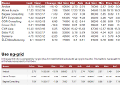

# Lightstreamer - Basic Stock-List Demo - AngularJS (ng-grid) Client #

A simple stocklist demo application showing integration between [AngularJS](http://angularjs.org/) and the Lightstreamer JavaScript Client library.

This demo displays real-time market data for ten stocks, generated by a feed simulator in a similar way to the [Lightstreamer - Basic Stock-List Demo - HTML Client](https://github.com/Weswit/Lightstreamer-example-StockList-client-javascript#basic-stock-list-demo---html-client).<br>


 [An online demonstration is hosted on our servers](http://demos.lightstreamer.com/AngularJSDemo)

This page uses the <b>JavaScript Client API for Lightstreamer</b> to handle the communications with Lightstreamer Server and uses <b>AngularJS</b> to display the real-time data pushed by Lightstreamer Server.

A Lightstreamer Subscription is used for subscribing to the data. The onItemUpdate callback implementation fills an object that is used by AngularJS to populate the HTML.
Three different approaches to the data display are shown; the first two use "vanilla" AngularJS while the third one is based on [ng-grid](http://angular-ui.github.io/ng-grid/)

The demo includes the following client-side technologies:
* A [Subscription](http://www.lightstreamer.com/docs/client_javascript_uni_api/Subscription.html) containing 10 items, subscribed to in **MERGE** mode.


# Deploy #

Before you can run the demos of this project some dependencies need to be solved:

-  Get the lightstreamer.js file from the [Lightstreamer 5 Colosseo distribution](http://www.lightstreamer.com/download) 
   and put it in the "src/js" folder of the demo. Alternatively you can build a lightstreamer.js file from the 
   [online generator](http://www.lightstreamer.com/distros/Lightstreamer_Allegro-Presto-Vivace_5_0_Colosseo_20120803/Lightstreamer/DOCS-SDKs/sdk_client_javascript/tools/generator.html).
   In that case be sure to include the LightstreamerClient, Subscription, and StatusWidget modules and to use the "Use AMD" version.
-  Get the require.js file form [requirejs.org](http://requirejs.org/docs/download.html) and put it in the "src/js" folder of the demo.
-  AngularJS is currently hot-linked in the html page: you may want to replace it with a local version and/or to upgrade its version.

The above setup will make the first two table work. To also start the ng-grid version run:

-  jQuery is currently hot-linked in the html page: you may want to replace it with a local version and/or to upgrade its version.
-  Also ng-grid is currently hot-linked in the html page: again, you may want to replace it with a local version and/or to upgrade its version.

You can deploy this demo inside Lightstreamer internal web server or in any other web server.
If you choose the former please create a new folder under <LS_HOME>/pages/ and copy the contents of the src folder of this project there.

The client demos configuration assumes that Lightstreamer Server, Lightstreamer Adapters and this client are launched on the same machine. If you need to target a different Lightstreamer server please search for this line:
```js
var lsClient = new LightstreamerClient(protocolToUse+"//localhost:8080","DEMO");
```
in lsClient.js and change it accordingly.

Note that the [QUOTE_ADAPTER](https://github.com/Weswit/Lightstreamer-example-Stocklist-adapter-java) and [LiteralBasedProvider](https://github.com/Weswit/Lightstreamer-example-ReusableMetadata-adapter-java) have to be deployed in your local Lightstreamer server instance for this demo to correctly work. 
The factory configuration of Lightstreamer server already has these adapters deployed though.

The demo is now ready to be launched.

# See Also #

## Adapters used by this client ##

* [Lightstreamer - Stock-List Demo - Java Adapter](https://github.com/Weswit/Lightstreamer-example-Stocklist-adapter-java)
* [Lightstreamer - Reusable Metadata Adapters - Java Adapter](https://github.com/Weswit/Lightstreamer-example-ReusableMetadata-adapter-java)

## Similar clients that may interest you ##

* [Lightstreamer - Stock-List Demos - HTML Clients](https://github.com/Weswit/Lightstreamer-example-Stocklist-client-javascript)


# Lightstreamer Compatibility Notes #

- Compatible with Lightstreamer JavaScript Client library version 6.0 or newer.
